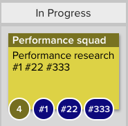
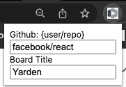

# LeanKit to Github

[PlanView AgilePlace \ PlanView LeanKit](https://www.planview.com/products-solutions/products/agileplace/)

A tiny chrome extension that adds GitHub links to cards which references github issue or pull request.

You can customize the board's title which you want to focus on, and your favorite GitHub repository which you want to go to

